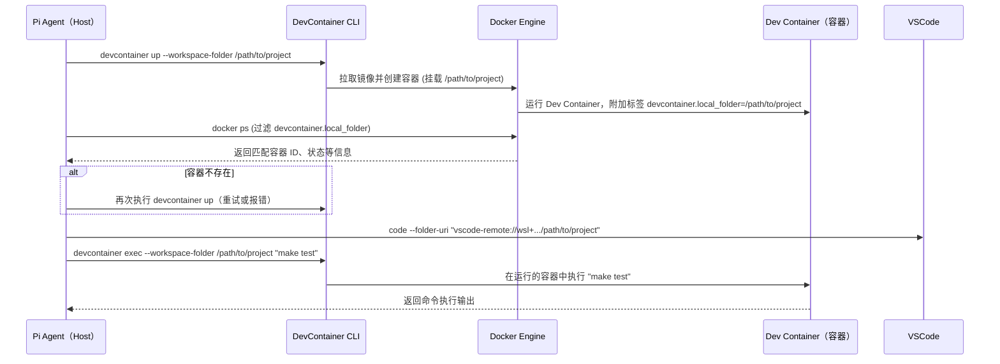

可以，这个需求我理解成：

```text
Host
├── Pi Coding Agent   ← 只安装这一份
├── Docker
├── VS Code
│
├── project-a
│   └── VS Code DevContainer A
├── project-b
│   └── VS Code DevContainer B
└── project-c
    └── VS Code DevContainer C
```

然后希望 Host 上的 Pi 能做到：

```text
Pi → DevContainer A → npm test
Pi → DevContainer B → pytest
Pi → DevContainer C → cargo build
```

而**不在 A/B/C 里面分别安装 Pi**。

这个架构完全可行，而且 Pi 自己的文档明确把它作为一种支持的模式：**Pi 进程运行在 host，tool execution 路由到隔离环境/container 中**。([GitHub][1])

不过，我查到的现有插件里，需要区分两种程度。

### 1. “一份 Pi 安装 + 多个 Pi session”——现在已经基本可以

`pi-dev-worktrees` 很接近你的需求。

你可以只在宿主机全局安装：

```bash
pi install npm:@lanquarden/pi-dev-worktrees
```

然后关闭你不需要的 worktree 功能：

```json
// ~/.pi/agent/pi-dev-worktrees.config.json
{
  "worktrees": {
    "enabled": false
  },
  "devcontainer": {
    "enabled": true
  }
}
```

插件明确支持这种配置：worktree 和 devcontainer 是独立能力；关闭 worktree 后，**Pi 启动时的 cwd 就是 authoritative workspace**，所有 devcontainer 的发现、启动、exec、stop、rebuild 都围绕这个 cwd 进行。([GitHub][2])

例如：

```bash
cd ~/code/project-a
pi
```

然后：

```text
/devcontainer on
```

Pi 后续：

```bash
npm test
python manage.py test
node ...
```

实际上都会变成类似：

```bash
devcontainer exec \
  --workspace-folder ~/code/project-a \
  ...
```

进入 Project A 的容器执行。插件会先检查已有 Dev Container；如果 VS Code 已经启动了它，会尽量**复用现有 container，而不是再启动一份**。([GitHub][2])

另开一个终端：

```bash
cd ~/code/project-b
pi
```

同一个宿主机上的 Pi 安装：

```text
Pi session A → DevContainer A
Pi session B → DevContainer B
Pi session C → DevContainer C
```

因此如果你说的“单个安装”是：

> **只在宿主机 npm/global 安装一次 Pi，不在任何 DevContainer 安装 Pi**

那么答案是：**可以，而且现成的 `pi-dev-worktrees` 已经相当符合。**

---

### 2. “一个 Pi 进程/session，随时切换所有 VS Code DevContainers”——现成插件目前还差一点

这应该更接近你最终想要的体验：

```text
$ pi

> 列出我目前所有 VS Code DevContainers

1. frontend   ~/src/frontend
2. backend    ~/src/backend
3. firmware   ~/src/firmware

> 使用 backend
✓ Target → backend

> 跑测试
→ backend: pytest

> 切到 frontend
✓ Target → frontend

> 跑 lint
→ frontend: pnpm lint
```

我目前没有搜到一个成熟 Pi 插件直接提供这种 **global devcontainer registry + runtime switcher**。

`pi-dev-worktrees` 当前的设计还是：

```text
Pi session cwd
      ↓
寻找“这个 workspace”的 devcontainer
      ↓
/devcontainer on
      ↓
该 session 的 bash → container
```

README 也明确说明：container 操作是 rooted at **Pi 启动时的 exact cwd**。如果恢复了另一个 workspace 的 container 状态，它会根据当前 cwd 重新 reconcile。([GitHub][2])

换句话说，它更偏：

```text
1 Pi installation
N Pi sessions
N devcontainers
```

而不是：

```text
1 Pi installation
1 Pi session
N dynamically selectable devcontainers
```

---

## 不过实现你想要的东西其实不复杂

原因是 VS Code Dev Containers 本身已经给我们留下了很好用的识别机制。

由 VS Code / Dev Containers CLI 创建的 container 通常带有类似：

```text
devcontainer.local_folder=/home/me/project-a

devcontainer.config_file=/home/me/project-a/.devcontainer/devcontainer.json
```

这样的 label。Dev Containers 的规范也明确提到了使用 `devcontainer.local_folder` 这样的 label 来唯一识别本机 Dev Container。([GitHub][3])

实际的 VS Code Dev Containers CLI 日志里也能看到它通过：

```bash
docker ps \
  --filter label=devcontainer.local_folder=/some/project \
  --filter label=devcontainer.config_file=/some/project/.devcontainer/devcontainer.json
```

寻找对应容器。([GitHub][4])

而官方 `devcontainer` CLI 已经支持：

```bash
devcontainer exec \
  --workspace-folder ~/code/project-a \
  npm test
```

也就是说 **不要求 Pi 本身存在于 container 内**。([GitHub][5])

所以可以给 Pi 做一个很薄的 global extension：

```text
                    Host
                      │
              ┌───────▼────────┐
              │   single Pi     │
              │ Coding Agent    │
              └───────┬────────┘
                      │
             devcontainer tool
                      │
       ┌──────────────┼──────────────┐
       │              │              │
       ▼              ▼              ▼
  frontend         backend        firmware
 DevContainer     DevContainer    DevContainer
```

提供几个 LLM tool：

```text
devcontainers_list()
devcontainer_select(workspace)
devcontainer_exec(command)
devcontainer_status()
devcontainer_start(workspace)
devcontainer_rebuild(workspace)
```

例如 Pi 可以自己调用：

```json
devcontainer_select({
  "workspace": "/home/me/src/backend"
})
```

之后所有：

```text
bash
```

自动 wrapper 成：

```bash
devcontainer exec \
  --workspace-folder /home/me/src/backend \
  sh -lc '<command>'
```

### `list` 甚至可以直接这样实现

宿主机：

```bash
docker ps \
  --filter label=devcontainer.local_folder \
  --format '{{.ID}}\t{{.Label "devcontainer.local_folder"}}'
```

得到类似：

```text
9ab31c    /home/me/src/frontend
abc832    /home/me/src/backend
d93a18    /home/me/src/firmware
```

Pi 就可以知道：

```text
目前有 3 个 DevContainer：

frontend → /home/me/src/frontend
backend  → /home/me/src/backend
firmware → /home/me/src/firmware
```

然后再使用 `devcontainer exec --workspace-folder ...`，而不是直接裸 `docker exec`。

我更推荐 **devcontainer CLI 而非 docker exec**，因为 Dev Containers CLI 知道 workspace、remote user、environment 等 Dev Container 语义；官方 CLI 的示例也是从 host 使用 `devcontainer exec --workspace-folder ...` 进入开发容器。([GitHub][5])

---

## 我会把你的目标架构定成这样

```text
                       HOST
┌─────────────────────────────────────────────────┐
│                                                 │
│  ~/.pi/agent                                    │
│       │                                         │
│       └── Pi Coding Agent   ← 唯一安装           │
│               │                                 │
│               │ global extension                │
│               ▼                                 │
│        devcontainer-manager                     │
│          │            │                         │
│          │ discovery  │ execution               │
│          ▼            ▼                         │
│       docker ps    devcontainer exec             │
│                                                 │
└──────────────┬────────────┬────────────┬─────────┘
               │            │            │
               ▼            ▼            ▼
         ┌──────────┐ ┌──────────┐ ┌──────────┐
         │ VSCode   │ │ VSCode   │ │ VSCode   │
         │ DevCon A │ │ DevCon B │ │ DevCon C │
         └──────────┘ └──────────┘ └──────────┘
           Node.js       Python        Rust
```

容器里**完全不需要**：

```text
node
npm install pi
~/.pi
API keys
Pi session
```

Pi 的：

```text
credentials
模型配置
extensions
sessions
skills
```

全部留在 Host。

这是我认为最干净的设计，而且也符合 Pi 官方文档里“host Pi + routed tool execution”的架构。([GitHub][1])

### 所以结论

**如果你的要求只是“一份 Pi 安装控制不同项目的 DevContainer”**：

现有的 **`pi-dev-worktrees` + `worktrees.enabled=false` 已经可以满足大部分需求**，只是通常一个项目对应一个 Pi session。([GitHub][2])

**如果你的要求是“一个常驻 Pi session 可以枚举 / select / switch 任意正在运行的 VS Code DevContainer”**：

我目前没有找到完全匹配的现成插件；但 Dev Container 提供的 label + `devcontainer exec` 已经把底层能力全部准备好了，**做一个 Pi extension 会非常直接**。

而且我觉得后一个其实更符合你描述的目标：不要让 Pi 属于任何项目，**Pi 属于 Host，DevContainers 只是 Pi 可以选择的 execution targets**。

如果你愿意，我下一步可以直接帮你把这个 **`pi-devcontainer-manager` Pi extension** 写出来，做到 `/containers`、`/container use <name>`，以及让 Agent 自己拥有 `list/select/exec` 三个 tool。

[1]: https://github.com/earendil-works/pi/blob/main/packages/coding-agent/docs/containerization.md?utm_source=chatgpt.com "pi/packages/coding-agent/docs/containerization.md at main · earendil-works/pi · GitHub"
[2]: https://github.com/lanquarden/pi-dev-worktrees?utm_source=chatgpt.com "GitHub - lanquarden/pi-dev-worktrees: Pi worktree and devcontainer extension · GitHub"
[3]: https://github.com/devcontainers/spec/blob/main/docs/specs/devcontainer-features.md?utm_source=chatgpt.com "spec/docs/specs/devcontainer-features.md at main · devcontainers/spec · GitHub"
[4]: https://github.com/devcontainers/cli/issues/625?utm_source=chatgpt.com "Support snap based Linux system · Issue #625 · devcontainers/cli · GitHub"
[5]: https://github.com/devcontainers/cli?utm_source=chatgpt.com "GitHub - devcontainers/cli: A reference implementation for the specification that can create and configure a dev container from a devcontainer.json. · GitHub"


# 执行摘要

本技术方案针对开发**pi-devcontainer-manager**扩展的目标、架构和实现细节进行了全面规划。首先列出**核心功能**（必需/可选/未来扩展），包括：自动发现项目中的 `.devcontainer` 配置、容器列表及状态查询 (list/status)、启动容器 (start/up)、停止容器 (stop/down)、重建容器 (rebuild)、在容器中执行命令 (exec)、复用已存在容器、以及与 VS Code 同步（自动打开或复用 VS Code 窗口）。每项功能均设计相应的 LLM 工具接口（如 list/select/exec/status/start/rebuild/logs）。接着设计系统**架构**，用 mermaid 图演示 Host 上的 Pi Agent 与 Dev Container CLI、Docker、VS Code 的交互流程，并分析“仅 Host 运行 Pi”与“容器内运行 Pi”两种部署模式的区别，推荐在宿主机运行 Pi、通过工具路由的方案。在**扩展实现细节**中，说明 `package.json` 的必须字段（`name`、`keywords:["pi-package"]` 及 `pi.extensions` 等）、注册的工具和命令，以及各工具的输入输出 Schema。给出示例命令模板（如 `devcontainer up --workspace-folder <path>`、`devcontainer exec --workspace-folder <path> <cmd>`）和如何通过容器标签或 `docker ps` 做容器发现。重点展示自定义工具实现：使用 `pi.registerTool` 重写内置 `bash` 工具，通过 `createBashTool` 的 `spawnHook` 将命令路由到 `devcontainer exec`。同时讨论错误处理与重试策略（如检测 CLI 命令执行结果、捕获异常重试等）。

此外提供关键**代码示例**（TypeScript）：扩展入口 (`index.ts`) 的引导逻辑、工具处理器代码、devcontainer 发现函数、`exec` 封装示例、配置读取与重写示例，以及单元/集成测试要点。**安全与权限**方面，阐述如何安全调用 Docker/Dev Container CLI（加入 `docker` 用户组或使用 `sudo`）、最小权限原则、保护 API 密钥和模型配置（避免在容器中泄露敏感信息）、以及容器内命令执行的风险控制（使用 Pi 的沙箱或路由策略）。**测试与验证**计划涵盖单元测试、集成测试、端到端测试（多项目、多容器场景）、性能并发测试用例，并给出 CI/CD 示例（如 GitHub Actions 脚本片段）。**迁移与兼容性**方面，列出对不同 devcontainer CLI 版本、Docker/Podman 的兼容性考虑，以及 Windows/Mac/Linux 系统差异；并分析与现有 pi-dev-worktrees 方案的兼容或替代策略。最后给出**交付物清单与里程碑**：列出 MVP 功能、粗略开发周期估算、示例仓库结构，以及发布到 Pi 包注册表（npm）的步骤。方案中使用表格对比功能优先级、CLI 命令映射、兼容性矩阵，并通过 mermaid 图详细说明架构与流程。

## 目标功能

扩展需实现以下功能： 

- **自动发现 DevContainer**（必需）：扫描当前工作区及子目录中的 `.devcontainer/devcontainer.json` 文件，解析并记录项目容器配置路径。  
- **列出容器(List/Status)**（必需）：显示当前已启动的开发容器列表及其状态（运行/停止），包括项目路径、容器ID、标签等。  
- **启动容器(Start/Up)**（必需）：根据项目路径启动 DevContainer，可调用 `devcontainer up` CLI 命令。  
- **停止容器(Stop/Down)**（必需）：停止指定容器（`devcontainer stop`）或停止并删除容器 (`devcontainer down`)。  
- **重建容器(Rebuild)**（可选）：重新构建并启动容器（如通过 `devcontainer build` 或 `devcontainer up --build`）。  
- **执行命令(Exec)**（必需）：在激活的 DevContainer 中执行任意 shell 命令，调用 `devcontainer exec`。  
- **复用容器(Reuse)**（必需）：若目标容器已存在则复用而非重复创建。通过容器标签（如 `devcontainer.local_folder`）和 `docker ps` 匹配容器识别。  
- **VS Code 同步**（可选）：自动在新容器中打开或复用 VS Code 窗口，例如使用 `code` 命令或（旧版）`devcontainer open` 功能。  
- **LLM 工具接口**（必需）：为上述操作分别提供可由 LLM 调用的工具，如 `listContainers`、`selectContainer`、`execInContainer`、`containerStatus`、`startContainer`、`rebuildContainer`、`showLogs` 等，每个工具定义输入输出 schema。  
- **配置文件支持**（必需）：支持在全局(`~/.pi/agent/settings.json`)或项目(`.pi/settings.json`)级别配置扩展选项，如使用 Podman 还是 Docker、默认工作目录等。  
- **安全与边界**（必需）：实现最小权限访问控制，例如限制 Pi 调用 docker 的权限，保护用户 API 密钥，隔离容器执行风险。  
- **日志与监控**（可选）：收集容器生命周期日志、命令执行日志，并提供监控接口（可后期扩展）。  

表：功能与类型对比

| 功能                         | 类型     | 说明                                                     |
|------------------------------|----------|----------------------------------------------------------|
| 自动发现 DevContainer        | 必需     | 扫描 `.devcontainer` 配置文件并管理项目容器               |
| 列出容器 (list/status)       | 必需     | 显示所有运行中的 DevContainer 及其状态                   |
| 启动容器 (start/up)          | 必需     | 调用 `devcontainer up` 启动开发容器       |
| 停止容器 (stop/down)         | 必需     | 调用 `devcontainer stop/down` 停止或删除容器 |
| 重建容器 (rebuild)           | 可选     | 调用 `devcontainer build` 或 `up --build` 重建容器         |
| 命令执行 (exec)              | 必需     | 在容器中执行命令，使用 `devcontainer exec --workspace-folder` |
| 复用容器                     | 必需     | 已存在容器则复用，避免重复创建                             |
| VS Code 同步                 | 可选     | 自动在容器中打开/复用 VS Code 窗口                         |
| LLM 工具接口                 | 必需     | 提供 list/select/exec/status/start/rebuild/logs 等工具      |
| 配置支持                     | 必需     | 读取 Pi 配置文件中的扩展配置选项                         |
| 权限安全                     | 必需     | 控制 Docker/CLI 权限，保护密钥，容器执行隔离             |
| 日志与监控                   | 可选     | 收集和展示容器运行日志（后续扩展）                        |

表：CLI命令映射示例

| 操作        | 对应命令                                                   | 说明                      |
|-------------|------------------------------------------------------------|---------------------------|
| 启动容器    | `devcontainer up --workspace-folder <project_path>`       | 按 `devcontainer.json` 配置构建并启动容器 |
| 重建容器    | `devcontainer build --workspace-folder <project_path>`    | 构建容器镜像（可加 `--push` 推送）  |
| 停止容器    | `devcontainer stop --workspace-folder <project_path>`     | 停止容器       |
| 删除容器    | `devcontainer down --workspace-folder <project_path>`     | 停止并删除容器 |
| 执行命令    | `devcontainer exec --workspace-folder <project_path> <cmd>` | 在容器中执行 `<cmd>` |
| 容器列表    | `docker ps --filter "label=devcontainer.local_folder=<path>"` | 列出匹配项目路径标签的容器（无官方命令） |
| 查看日志    | `docker logs <containerId>`                                | 获取容器日志（自定义实现） |

## 架构设计

下图展示了**系统架构**及数据流：Pi Agent 运行在宿主机上，通过调用 Dev Container CLI 和 Docker API 管理开发容器，并与 VS Code 交互。



```mermaid
graph LR
    subgraph 宿主机 Host
        PiAgent[Pi Agent<br/>(Node.js)] 
        DevCLI[DevContainer CLI<br/>(Node.js)]
        DockerEng[Docker Engine]
        VSCode[VS Code]
    end
    subgraph 开发容器 DevContainer
        WorkContainer[容器实例]
    end
    PiAgent -->|调用 CLI 命令| DevCLI
    PiAgent -->|管理&查询| DockerEng
    DevCLI -->|创建/管理| DockerEng
    DockerEng -->|运行| WorkContainer
    VSCode -->|Remote-Container 连接| WorkContainer
    PiAgent -->|打开/聚焦窗口| VSCode
```

**部署模式对比：**Pi 可在宿主机上运行，只将具体工具调用路由到容器中。这种模式下，Pi 拥有全部访问权限，但实际操作（例如文件读写、命令执行）可定向到开发容器中。另一种模式是将整个 Pi 进程运行在容器里，此时容器中包含 Pi 和工具，但隔离级别不同。我们推荐“宿主机运行 Pi，使用工具路由”方案，便于直接访问用户文件系统和配置，同时通过 `devcontainer exec` 将需要的操作安全隔离到容器内执行。

## 扩展/包的实现细节

- **package.json/Manifest**：在 `package.json` 中需包含 `"pi"` 字段并指定资源路径，示例：
  ```json
  {
    "name": "pi-devcontainer-manager",
    "version": "1.0.0",
    "keywords": ["pi-package", "devcontainer"],
    "pi": {
      "extensions": ["./dist/index.js"]
    }
  }
  ```
  关键是使用 `"keywords": ["pi-package"]` 让 Pi 包管理识别。扩展入口一般为 `index.ts` 导出默认工厂函数。

- **注册工具**：在扩展工厂函数中使用 `pi.registerTool()` 注册自定义工具，并可 `pi.registerCommand()` 注册命令。覆盖内置工具（如 `bash`）可通过相同名称注册。示例：重写 `bash` 工具，将执行命令路由到 DevContainer：
  ```ts
  import { createBashTool, type BashToolOutput } from "@earendil-works/pi-coding-agent";
  const cwd = process.cwd();
  // 创建可定制的 Bash 工具
  const bashTool = createBashTool(cwd, {
    spawnHook: ({ command, cwd, env }) => {
      if (selectedWorkspace) {
        // 使用 devcontainer exec 运行命令
        return {
          command: `devcontainer exec --workspace-folder ${selectedWorkspace} bash -lc "${command}"`,
          cwd,
          env
        };
      }
      return { command, cwd, env };
    }
  });
  pi.registerTool({
    name: "bash",
    label: "Shell",
    description: "Run shell command (in DevContainer if selected)",
    async execute(id, params, signal, onUpdate, ctx) {
      return await bashTool.execute(id, params, signal, onUpdate);
    }
  });
  ```
  该代码示例演示了如何使用 `spawnHook` 将用户输入的命令包装成 `devcontainer exec` 调用。

- **工具接口定义（输入/输出 Schema）**：每个 LLM 工具需声明 `input` 类型和 `output` 类型。示例工具接口：
  - `listContainers(): {containers: Array<{path: string, containerId: string, status: string}>}` — 列出可用 DevContainer。
  - `selectContainer(path: string): {success: boolean}` — 选定一个工作区路径作为当前容器目标。
  - `execInContainer(cmd: string): {output: string, success: boolean}` — 在当前容器中执行命令。
  - `startContainer(path: string): {success: boolean, containerId?: string}` — 启动指定路径的容器。
  - `stopContainer(containerId: string): {success: boolean}` — 停止容器。
  - `rebuildContainer(path: string): {success: boolean}` — 重建并启动容器。
  - `getLogs(containerId: string): {logs: string}` — 获取容器日志。  

- **调用 DevContainer CLI**：通过 `child_process.spawn` 或类似方式执行 CLI 命令。如：
  ```ts
  const cmd = `devcontainer up --workspace-folder ${workspacePath}`;
  const result = spawnSync(cmd, { shell: true });
  // 检查 result.status 和输出
  ```
  对于 `exec`，命令格式为 `devcontainer exec --workspace-folder ${path} ${command}`。解析 CLI 输出时，注意 CLI 可返回 JSON，例如 `{ "outcome":"success", "containerId":"..." }`。  

- **容器发现**：使用 `docker ps` 结合标签过滤当前项目容器。如：
  ```bash
  docker ps --filter "label=devcontainer.local_folder=${workspacePath}" --format "{{.ID}}\t{{.Status}}"
  ```
  `devcontainer up` 运行时会为容器添加标签 `devcontainer.local_folder=<path>`，可据此匹配。此法效率高、跨平台。

- **错误处理与重试**：所有外部调用应捕获异常，检查返回码和输出。如果 CLI 命令失败，可根据错误类型重试（如网络超时可延迟重试）。对 `devcontainer up` 失败可尝试先 `stop/down` 再 `up`。对超大输出应进行截断。在工具中应用 π 提供的截断方法（`truncateHead/Line`）避免上下文过载。

- **配置文件格式**：可允许用户在 `.pi/agent/settings.json` 或项目 `.pi/settings.json` 中配置扩展参数，例如：
  ```jsonc
  {
    "pi-devcontainer-manager": {
      "usePodman": false,
      "vsCodePath": "code"
    }
  }
  ```
  扩展启动时读取这些配置（可通过 Node `process.env.PI_PROJECT_CONFIG` 或 Pi API）。同时在 `package.json` 的 `pi` 字段中也可嵌入默认配置。

- **LLM Tool 调用示例**：例如，请求启动容器的 JSON：
  ```json
  {"name":"startContainer","arguments":{"path":"/workspaces/my-project"}}
  ```
  执行该工具将调用 `devcontainer up --workspace-folder /workspaces/my-project` 并返回结果。

## 关键代码示例

以下示例展示扩展的部分核心实现：  

- **扩展入口 (extension bootstrap)**：`src/index.ts`
  ```ts
  import type { ExtensionAPI } from "@earendil-works/pi-coding-agent";
  export default async function (pi: ExtensionAPI) {
    // 注册状态工具
    pi.registerTool({ name: "listContainers", label: "List Containers", description: "List Dev Containers",
      async execute(id, params, signal, onUpdate) {
        const result = spawnSync(`docker ps --filter "label=devcontainer.local_folder" --format "{{.ID}}\t{{.Names}}"`, { shell: true });
        const containers = result.stdout.toString().trim().split("\n").map(line => {
          const [id, name] = line.split("\t");
          return { id, name };
        });
        return { id, output: { containers } };
      }
    });
    // 更多工具注册...
    pi.sendMessage("pi-devcontainer-manager loaded.");
  }
  ```
  该代码使用 `pi.registerTool` 注册了一个 `listContainers` 工具，内部调用 `docker ps` 并返回容器列表。

- **DevContainer 发现函数**：
  ```ts
  function findDevContainerId(workspace: string): string | null {
    const labelFilter = `label=devcontainer.local_folder=${workspace}`;
    const result = spawnSync("docker", ["ps", "--filter", labelFilter, "--format", "{{.ID}}"]);
    const id = result.stdout.toString().trim().split("\n")[0];
    return id || null;
  }
  ```
  该函数查找给定工作区路径对应的容器 ID。

- **Exec 封装示例**：使用 `createBashTool` 的 `spawnHook` 处理 Exec：
  ```ts
  const bashTool = createBashTool(process.cwd(), {
    spawnHook: ({ command, cwd, env }) => {
      if (activeWorkspace) {
        return {
          command: `devcontainer exec --workspace-folder ${activeWorkspace} bash -lc "${command}"`,
          cwd, env
        };
      }
      return { command, cwd, env };
    }
  });
  pi.registerTool({
    ...bashTool,
    name: "bash",
    label: "Shell",
    description: "Run shell command (redirected to DevContainer if active)",
    async execute(id, params, signal, onUpdate, ctx) {
      // 调用自定义 bash 工具执行
      return await bashTool.execute(id, params, signal, onUpdate);
    }
  });
  ```
  此片段将 `/usr/bin/bash` 命令包装为 Pi 工具，如果有选定的容器 `activeWorkspace` 则使用 `devcontainer exec` 进入容器执行。

- **配置读取与 Override 生成**：在扩展中读取 Pi 的设置：
  ```ts
  const config = pi.config.get("pi-devcontainer-manager") || {};
  const usePodman = config.usePodman || false;
  ```
  或从 `process.env` 获取项目配置路径，并合并到默认配置中。

- **单元/集成测试要点**：测试可模拟 `child_process.spawnSync` 返回值，验证工具函数（如命令构造、输出解析）正确。例如使用 Jest：
  ```ts
  test("listContainers parses output correctly", () => {
    jest.spyOn(cp, "spawnSync").mockReturnValue({ stdout: Buffer.from("id1\tcontainer1\nid2\tcontainer2\n") });
    const containers = listContainersTool.execute( /*...*/ );
    expect(containers).toEqual([{id:"id1", name:"container1"}, {id:"id2", name:"container2"}]);
  });
  ```

## 安全与权限

- **Docker/DevContainer 调用权限**：建议将运行 Pi 的用户加入 `docker` 组以无须 `sudo` 调用 Docker/Dev Container CLI（在 Linux 上常见）。或者在命令前加 `sudo`，但需谨慎配置免密执行。确保 CLI 的路径或 Node 环境在授权范围内。  
- **最小权限原则**：Pi 扩展只在必要时调用 CLI 命令。可考虑在项目根目录设置只读/只写挂载限制，避免意外修改敏感文件。  
- **保护密钥与配置**：扩展不直接处理模型 API 密钥，但需注意不要在容器内暴露这些信息（如不要将主机环境变量明文传入容器）。在容器化方案中，可只映射项目代码，不映射主机的 `~/.pi` 或其他凭据存放目录。  
- **容器执行隔离**：所有命令通过 `devcontainer exec` 执行在容器内，默认容器已根据 `devcontainer.json` 配置隔离网络和文件系统。可以对容器启动时的权限进行审计（如不添加不必要的 CAP_* 权限）。同时，可利用 Pi 的沙箱策略，避免对主机进行不受控操作。

## 测试与验证计划

- **单元测试**：针对每个工具函数编写单元测试，使用 Jest 或 Vitest。模拟 CLI 返回值，验证命令组装和输出解析正确性。测试边界情况（无容器、多个容器、命令错误等）。  
- **集成测试**：在真实或模拟环境中集成 Dev Container CLI 进行测试。例如，使用一个小型示例项目（如 VS Code 官方 Rust 示例）通过 `devcontainer up` 启动容器，然后验证扩展能正确识别和控制该容器。  
- **E2E 测试**：在多项目、多容器场景下测试流程。确保在多个工作区下执行 `listContainers`、`startContainer`、`execInContainer` 等操作时能正确区分容器实例。可采用脚本或容器化测试环境进行全流程演练。  
- **性能与并发测试**：对于列出和查询容器，测试在存在大量容器时的响应。测试并发调用命令（如同时对多个容器执行操作）是否安全。  
- **CI/CD 集成示例**：在 GitHub Actions 中使用 Dev Container CLI 进行预先构建和测试。例如，通过 matrix 策略在 Linux、macOS 上运行测试：  
  ```yaml
  jobs:
    test:
      runs-on: ubuntu-latest
      strategy:
        matrix:
          os: [ubuntu-latest, macos-latest]
      steps:
        - uses: actions/checkout@v3
        - name: Setup Node
          uses: actions/setup-node@v3
          with: {node-version: '18'}
        - name: Install dependencies
          run: npm install
        - name: Run unit tests
          run: npm test
        - name: Build DevContainer image
          run: devcontainer build --workspace-folder . --image-name test-devcontainer:latest
        - name: Integration Test
          run: devcontainer up --workspace-folder . --no-prompt --once; sleep 10; devcontainer exec --workspace-folder . echo "ok"
  ```
  该示例展示如何在 CI 中预构建 DevContainer 镜像并执行简单测试命令。

## 迁移与兼容性

- **DevContainer CLI 版本**：使用最新稳定版 Dev Containers CLI（v0.66+）。兼容性考虑：检查 CLI 命令参数变化。如旧版可能不支持 `exec` 或 `stop`，可降级支持或提示用户升级。  
- **Docker vs Podman**：理论上 DevContainer CLI 支持 Podman（需要在 `pi-settings` 中配置命令前缀）。不过，官方生态主要针对 Docker。方案中应允许用户配置 `usePodman` 选项，切换 CLI 调用前缀。测试需覆盖两种环境（例如 GitHub Runner 中的 Podman）。  
- **跨平台**：在 Windows 上通常通过 Docker Desktop 或 WSL2 使用 DevContainer。需注意路径格式（Windows 下需使用 `/mnt/c/...` 风格）和 shell 差异（PowerShell vs Bash）。在 macOS/Linux，路径兼容 Linux 格式。可根据 `process.platform` 设置命令差异。示例如 Windows 下可能使用 `powershell` 工具而非 `bash`。  
- **与 pi-dev-worktrees 的兼容**：若用户已使用现有的 `pi-dev-worktrees` 扩展，应平滑过渡或共存。可在拓展文档中说明二者区别：`pi-dev-worktrees` 专注基于 Git 工作树的虚拟环境管理，而本方案使用 VSCode DevContainer 规范，提供更通用的容器化工作环境。两者可以配合使用：例如每个工作树都可配置其 DevContainer。  

表：兼容性对比

| 项目                 | Docker             | Podman           | Windows (WSL2)    | MacOS              |
|----------------------|--------------------|------------------|-------------------|--------------------|
| 安装依赖             | Docker Engine      | Podman (可选)    | Docker Desktop    | Docker Desktop     |
| CLI 调用             | 直接调用 `devcontainer` CLI | 设置 `usePodman` 前缀 | 同 Linux (路径需特别处理) | 同 Linux          |
| 容器后端             | linux 容器         | linux 容器       | windows/WSL2 容器  | linux 容器         |
| 权限管理             | `docker` 组或 sudo | 通常无需 sudo    | `docker` 组或 sudo| `docker` 组或 sudo |
| 注意事项             |                  | 可能需设置 Podman alias (alias docker=podman) | 路径映射较复杂 | 带 `/Volumes` 路径 |

## 交付物清单与里程碑

- **MVP 功能列表**：自动发现 DevContainer、列出状态、启动/停止容器、在容器内执行命令、使用 LLM 工具接口。  
- **时间估算**（假设开发者熟悉 TypeScript/Node.js）：初始开发约 4-6 周，包括需求分析、编码和基础测试；额外 2-3 周进行兼容性测试和文档撰写，总计 ~6-9 周。  
- **示例仓库结构**：  
  ```
  pi-devcontainer-manager/
  ├─ src/
  │   ├─ index.ts          # 扩展入口
  │   ├─ tools.ts          # LLM 工具定义
  │   └─ utils.ts          # 辅助函数（CLI 调用、解析等）
  ├─ tests/
  │   ├─ unit/             # 单元测试
  │   └─ integration/      # 集成/端到端测试
  ├─ .pi/                  # 项目本地 Pi 设置 (示例)
  │   └─ settings.json
  ├─ package.json
  ├─ README.md
  └─ tsconfig.json
  ```
- **发布到 Pi 包注册表**：使用 npm 发布到仓库，例如 `npm publish`。用户可通过 `pi install npm:@owner/pi-devcontainer-manager` 安装。发布前需确保 `package.json` 的 `pi.extensions`、关键词等正确设置。  

通过以上方案，可构建一个全面的 `pi-devcontainer-manager` 扩展，使 Pi Agent 能无缝管理多项目 DevContainer 开发环境，提高开发效率和安全性。所有设计均参考官方文档和规范。